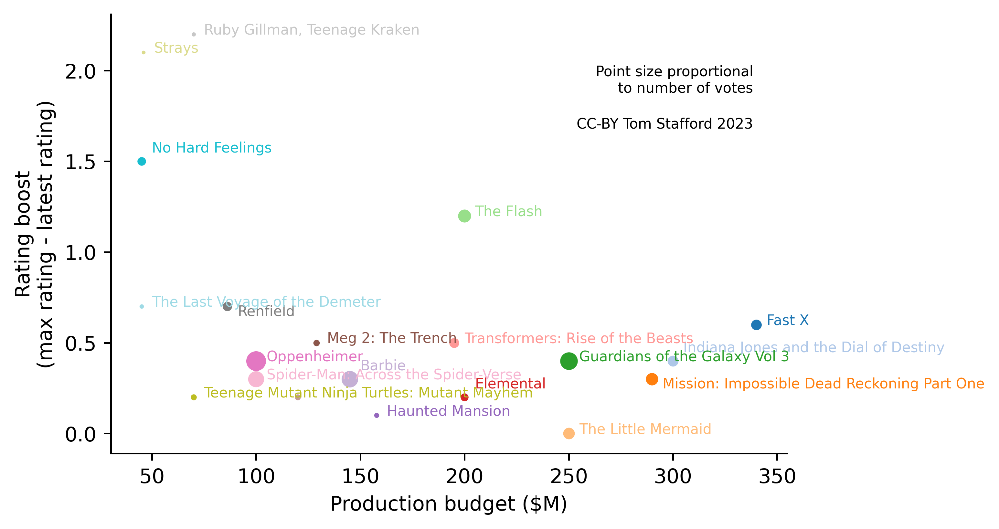
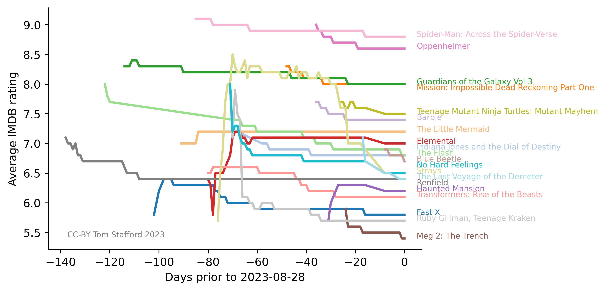

# Marketing, Movie Hype and Movie Ratings

We've all got used to looking at average review scores on rating sites, whether for restaurants, wines or movies. Sites like [imdb.com](imdb.com) are sitting on a huge dataset on human preferences. Lots of work has been done in the field of [Recommender Systems](https://en.wikipedia.org/wiki/Recommender_system) which looks at how we can make predictions about what people will like given ratings they have already provided, but I haven't seen anything great which looks at these data from a cognitive science angle, which tries to form a theory-based understanding  of why individuals give the ratings they do, and how things like expectations and previous experience affect ratings. 

As I way into this, I thought I'd look at the IMDB movie ratings and try and answer these questions

* How long after a movie has been released does the average rating stabilise?
* Does the (marketing) budget of the movie "boost" average ratings in the weeks immediate after release?


# Summer movies

I went to [the-numbers.com](https://www.the-numbers.com/movie/budgets/all) and got data on 2023 releases and their production budgets. I took the top 20 movies, by budget, with release dates after 12 April 2023 (when I started collecting rating data). Here's the top five:

|   released   | title                                      |   budget   |
|:------------:|--------------------------------------------|:----------:|
|  2023-05-19  | Fast X                                     | 340000000  |
|  2023-06-30  | Indiana Jones and the Dial of Destiny     | 300000000  |
|  2023-07-12  | Mission: Impossible Dead Reckoning Part One | 290000000  |
|  2023-05-26  | The Little Mermaid                         | 250000000  |
|  2023-05-05  | Guardians of the Galaxy Vol 3             | 250000000  |
|  2023-06-16  | The Flash                                 | 200000000  |


# Average rating vs time

Next I plotted the average rating the movie got on the first time it appeared in the IMDB data, and every day since. Here's the plot


From this you can see two things:

* Movie ratings fluctuate over time, sometimes bouncing up, but mostly dropping down
* Ratings tend to stabilise after about 90 days

I can think of two factors which might cause movie ratings would tend to drop down. One is that marketing and other hype associated with the movie makes think the movie is better than it is. The other is that the people who tend to like to movie the most - the kind of people who think they'll like particularly this movie - are the ones who go to see it first. Over time, the movie gathers more ratings from people less keen to see it, so the ratings tend to drop. Both factors could be true, but notice that the effect of marketing will be in different directions. If marketing confuses you about what you like after you've experienced it, the boost in movie ratings will be higher for more heavily marketed movies. If it marketing confuses you about what you are going to enjoy, it will persuade people who won't enjoy a movie to see it sooner and so the movie ratings will be lower than they would be otherwise.


# Budgets and marketing hype in ratings

I calculate the "boost" for each movie - simply the difference between the higher average rating a movie has received and the most recent rating (this is the rating which combined all votes every received, so it assumed to be most accurate). I can then plot this boost against the budget of each movie (assuming that a consistent propotion of each budget is spent on marketing, or at least that bigger budget movies have bigger marketing budgets).

 
 
 From this plot you can see that
 
 * Most movies get a boost of around ~0.5
 * Movies with fewer ratings are more likely to have unstable averages (and larger boosts)
 * There is no obvious relation between movie budget and boost
 
# Conclusion
 
 The lack of relation between budget and initial boost in ratings could be for a few reasons. It could be that, as mentioned above, marketing can pull average ratings in two directions and these effects cancel out; or it could be that all of these movies have large enough marketing budgets that you can't see any different between the in the effect of marketing; or it could be that marketing has no effect; or it could be that the marketing budget varies independently from the production budget.
 
 As a movie consumer, it is possible to make one conclusion: if you are looking at IMDB within 90 days of something being released you should mentally subtract ~0.5 from the average rating before using this to decide whether to see it or not.
 
I'm thinking about what else to do with these data, so feedback is welcome, by email or to @tomstafford

I'm also interested in other large datasets of rating/preference data, so if you work on these please get in touch.

---

## Colophon

This project uses a cron job to grab the daily data, and python (including pandas library) for subsequent data munging. Visualisations done using matplotlib.

IMDB data is available from [https://developer.imdb.com/non-commercial-datasets/]() under these [license](imdb_LICENSE.txt) terms

    Information courtesy of
    IMDb
    (https://www.imdb.com).
    Used with permission.

This project, including plots, are CC-BY Tom Stafford

Code and a few more details are available in the repo (but not the data, since it is not mine for onwards sharing)

## Director's Cut

Did you notice how I used an occlusion cue in the first line plot? Nice, eh. Code is really hacky, you just plot a slightly thicker white line before you plot the main (coloured) data line:

```
plt.plot(df['days'],df['averageRating'],'-',lw=3,color='white')
plt.plot(df['days'],df['averageRating'],'-',lw=2,color=moviecolor)   
```

Without this first line you get:



